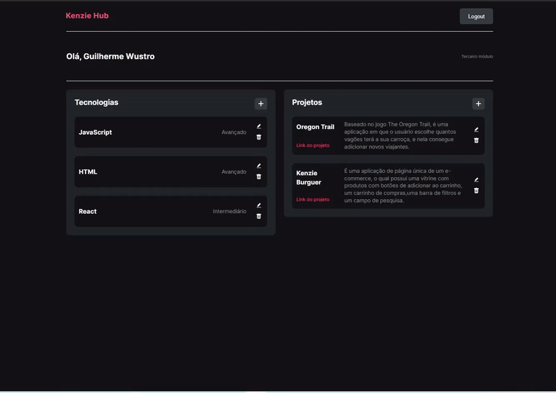

<!-- PROJECT LOGO -->
 

<h1 align="center">KenzieHub</h1>

  

    É uma aplicação desenvolvida para o usuário gerenciar as tecnologias aprendidas e os projetos criados.
  

<!-- ABOUT THE PROJECT -->
## Sobre o projeto

É uma aplicação desenvolvida para o usuário gerenciar as tecnologias aprendidas,
escolhendo o nível de entendimento da tecnologia (básico, intermediário ou
avançado). Além da adição de novas tecnologias na plataforma, o usuário é capaz
de editar e remover tecnologias.  

A aplicação também conta com uma página
de Login e Registro para novos usuários, tendo seus dados salvos numa API. A API
utilizada para fazer as requisições é a
<a href="https://github.com/Kenzie-Academy-Brasil-Developers/kenziehub-api">
KenzieHUB API</a>  

O Figma utilizado para o projeto foi
<a href="https://www.figma.com/file/ccZ4uMlJtuBQISDzCCI1Vq/Kenzie-Hub?node-id=0%3A1">
este aqui</a>

## Tecnologias utilizadas

O projeto foi realizado em React, e as bibliotecas utilizadas foram:

- Axios;
- Styled components;
- Context API;
- React Router DOM;
- Toastify;
- Framer motion;
- React icons;
- Yup;
- Hook-form;

<!-- USAGE EXAMPLES -->

## Usabilidade

<!-- ROADMAP -->

## Features

- [x] Criação de um novo usuário através da página /registro;
- [x] Validação dos dados ao se registrar, a senha possui requisitos mínimos
      para ser criada e todos os campos são obrigatórios. Tudo isso é notificado
      pela aplicação ao fazer a criação de uma nova conta.
- [x] Notificações de feedback ao usuário ao criar uma conta, fazer login,
      criação, alteração ou remoção de novas tecnologias e proejtos;
- [x] Login do usuário na plataforma, verificando se o usuário já está
      cadastrado;
- [x] O usuário é capaz de inserir novas tecnologias e novos projetos ;
- [x] O usuário é capaz de alterar e remover as tecnologias e os projetos já existentes;
- [x] Responsivo para todas as telas;
